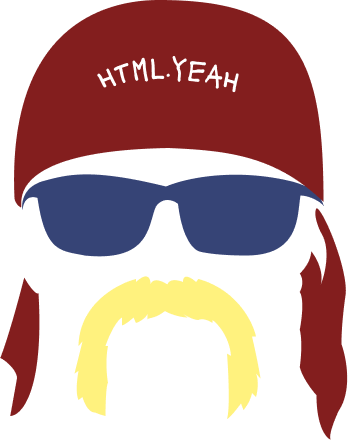
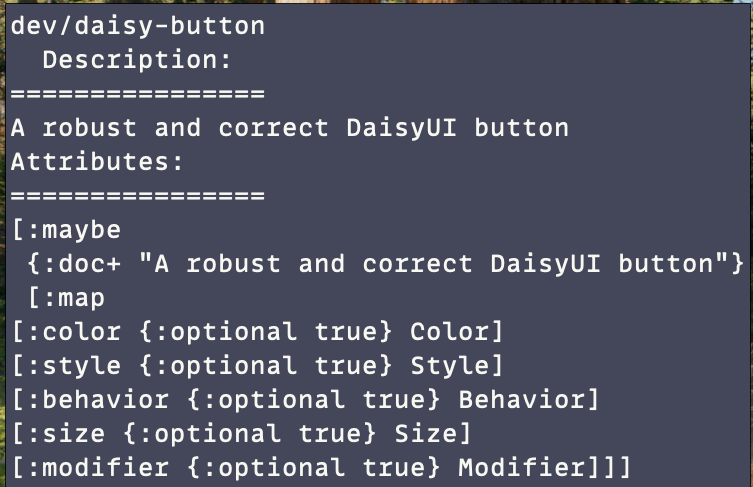
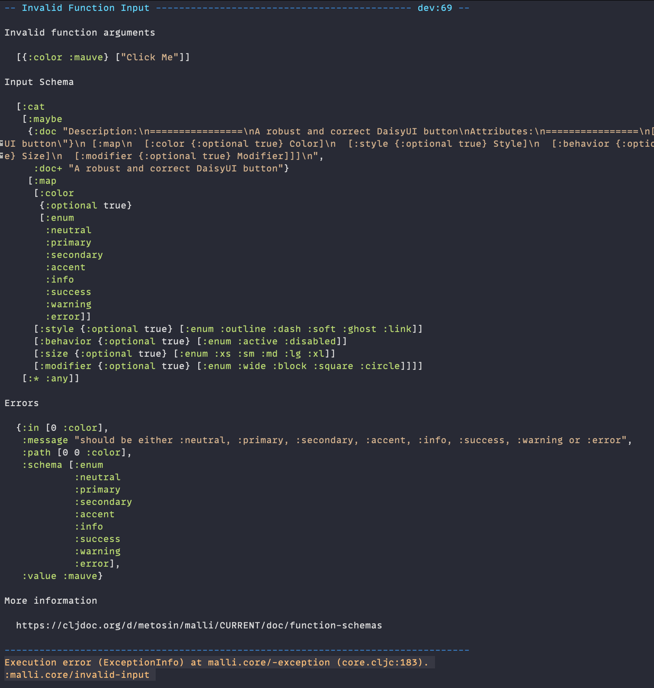

<p align="center">
  
</p>
<p align="center">
  
</p>

This is the beautiful red bandana to the luxuriant handlebar mustache that is [Chassis](https://github.com/onionpancakes/chassis). `html.yeah` provides a (totally optional) convenience
for defining [Chassis alias elements](https://github.com/onionpancakes/chassis?tab=readme-ov-file#alias-elements) in terms of an attribute
schema. Schema syntax follows [malli vector syntax](https://github.com/metosin/malli?tab=readme-ov-file#vector-syntax) (though malli itself is not a dependency of this library). Peep this smoke show:

``` clojure
(require '[dev.onionpancakes.chassis.core :as c])
(require '[html.yeah :as ya :refer [defelem children]])

;;; Server components the way nature intended

(defelem daisy-button
  [:maybe {:doc  "A robust and correct DaisyUI button"
           :keys [color style behavior size modifier]
           :or   {color :primary}}
   [:map
    [:color {:optional true} Color] ;;; [:enum :neutral :accent :primary]
    [:style {:optional true} Style]
    [:behavior {:optional true} Behavior]
    [:size {:optional true} Size]
    [:modifier {:optional true} Modifier]]]
  [:button {:class [(colors color)
                    (styles style)
                    (behaviors behavior)
                    (sizes size)
                    (modifiers modifier)]}
   (children)])
   
;;; Inspect it brother
(ya/attributes 'daisy-button) ; => get the attached malli schema

;;; Render it brother
(c/html [daisy-button {:color :neutral} "Html Yeah Brother"])
(c/html [::daisy-button {:color :netural} "Keywords work too!"])
```

See [dev.clj](dev/src/dev.clj) or [yeah_test.clj](test/html/yeah_test.clj) for more examples.

## Table of Contents

- [Why?](#why)
- [The defelem macro](#the-defelem-macro)
    - [Everything is compiled](#everything-is-compiled)
	- [Schemas](#schemas)
- [Extending defelem](#extending-defelem)
    - [Attribute options](#attribute-options)
    - [Properties](#properties)
- [Runtime checks](#runtime-checks)
- [Generating elements](#generating-elements)

## Why?

I want:

- To define custom html elements explicitly in terms of their attributes and children
- To use [Chassis](https://github.com/onionpancakes/chassis) for its speed and flexibility
- An excellent development/repl experience. Never be lost wondering about attributes and their types
- To easily support attribute transformation - i.e Clojure data structures in, safe html out
- To easily support extension via compile time schema transformations
- The option to do runtime checks on attributes and children
- The option to generate sample elements conforming to a schema
- To be able to ignore this library entirely in a broader Chassis application

## The `defelem` macro

This is literally the only thing `html.yeah` brings to the table brother. It attaches a malli schema to a chassis alias element.

``` clojure
(ns dev
  (:require [html.yeah :as yeah :refer [defelem children]]))

(defelem simple-button
  [:map {:doc "A simple button with a schema for type"
         :as  attrs}
   [:type [:enum :submit :button]]]
  [:button (update attrs :type name)
   (children)])
```

Notice the traditional property syntax of a malli schema is extended to support associative destructuring.
Destructuring forms are stripped from schema metadata.

*Note:* These bindings cannot be used in the schema itself, just the element body.

Given an element's symbol, you can inspect its attribute schema from the REPL:

``` clojure
(yeah/attributes 'simple-button) ; => [:map [:type [:enum :submit :button]]]
```

You can look at *ALL* metadata for the element via `describe`:

``` clojure
(yeah/describe 'simple-button)
; => {:html.yeah/attributes [map...], :html.yeah/children [:* :any]}
```

If you evaluate the var you will get the namespace qualified tag used by Chassis:

``` clojure
simple-button ; => :dev/simple-button
```

The `html.yeah/children` macro is used as a generic placeholder for the children passed
to the alias element.

### Everything is compiled

The above `simple-button` element is equivalent to the following:

``` clojure
(ns dev
  (:require [dev.onionpancakes.chass.core :as c]
            [dev.onionpancakes.chassis.compiler :as cc]))
  
(defmethod c/resolve-alias ::simple-button
  [_ attrs children]
  (cc/compile
    [:button (update attrs :type name) children]))
```

If one of the binding forms: `let`, `when-some`, `when-let`, `if-some`, or `if-let` are encountered as the first form
in the element's body, those bindings will be hoisted above the compile.

``` clojure
(defelem let-button
  [:map {:keys [type]}
   [:type [:enum :submit :button]]]
  (let [as-string (name type)]
    [:button {:type as-string}
     (children)]))
	 
;;; Produced alias element

(defmethod c/resolve-alias ::let-button
  [_ attrs children]
  (let [{:keys [type]} attrs
        as-string (name type)]
    (cc/compile
      [:button {:type as-string}
        children])))
```

In the case of `if-let` and `if-some`, both branches of the expression will be compiled:

``` clojure
(defelem if-some-button
  [:map {:as attrs}
    [:some-type [:enum :button]]
    [:nil-type  [:enum :submit]]]
  (if-some [type (:some-type attrs)]
    [:button {:type type} (children)]
    [:button {:type (:nil-type attrs)} (children)]))
	
;;; Produced alias element

(defmethod c/resolve-alias ::if-some-button
  [_ attrs children]
  (if-some [type (:some-type attrs)]
    (cc/compile
      [:button {:type type} children])
    (cc/compile
      [:button {:type (:nil-type attrs)} children])))
```

### Schemas

The attribute schema is the focal point of `defelem` elements.

``` clojure
(defelem unordered-list
  [:map {:keys [class]
         :or {class []}
         :as attrs}
   [:class {:optional true} [:vector :string]]]
  (let [classes (into ["p-4"] class)]
    [:ul (assoc attrs :class classes)
     (children)]))
```

The above element specifies an unordered list element supporting a `:class` attribute as a vector of strings.

We can provide a schema property of `:html.yeah/children` to specify a schema for child elements:

``` clojure
(defelem unordered-list
  [:map {:html.yeah/children [:vector {:min 1} [:tuple [:enum :li] :string]] 
         :keys [class]
         :or {class []}
         :as attrs}
   [:class {:optional true} [:vector :string]]]
  (let [classes (into ["p-4"] class)]
    [:ul (assoc attrs :class classes)
     (children)]))
```

The shape of `(children)` mirrors whatever content is passed to the Chassis alias element. The underlying render function of the element, will have `:malli/schema` metadata added:

``` clojure
{:malli/schema [:=> [:cat ~attr-schema ~child-schema] :any]}
```

This ensures render functions are picked up by `malli.instrument` and `malli.dev`.

## Extending defelem

`html.yeah` supports extending elements 2 different ways: attribute options and properties. Attribute options are used to affect attribute transformation, and properties affect schema transformation. Both occur at compile time.

### Attribute options

Attribute options are used to control the forms (if any) produced for runtime transformation of attributes. A typical case for this might be converting an attribute that is a Clojure map into a json string. Or perhaps converting normal Clojure forms into some form of expression language in html.

Attribute options are defined on the multimethod `html.yeah.attrs/option`. Once an implementation is defined this way, the attribute key can be used in the attribute schema's property map.

Consider the bundled `:html.yeah.attrs/transform` option:

``` clojure
(ns html.yeah.attrs)

(defmethod option ::transform
  [attr forms tag schema value]
  (cons `(~value ~tag) forms))
```

All attribute forms will be part of a `(->>)` thread last expression where the tail argument is assumed to be the attribute map.

``` clojure
(ns dev
  (:require [charred.api :as json]
            [html.yeah.attrs :as attrs]))

(defn transform
  "attrs in tail position"
  [tag attrs]
  (if (map? (:data-signals attrs))
    (update attrs :data-signals json/write-json-str)
    attrs))

(defelem signal-div
  [:map {::attrs/transform transform  ;;; Use a var if using a multimethod - i.e #'transform
         :as attrs}]
  [:div attrs (children)])
```

We can get pretty creative. Here is an example of creating an element that supports [Alpine.js](https://alpinejs.dev/) with Clojure maps for state and ClojureScript forms instead of string based JavaScript:


``` clojure
(ns dev
  (:require [charred.api :as json]
            [clojure.string :as string]
			[html.yeah :refer [defelem]]
			[html.yeah.attrs :as attrs]
            [squint.compiler :as compiler]))

(defn js
  [body]
  (let [s        (pr-str body)
        compiled (compiler/compile-string* s {:elide-imports true
                                              :core-alias "$squint"
                                              :elide-exports true})]
    (string/trim
     (:body compiled))))

(defmethod attrs/option ::alpinejs
  [_ forms _ _ value]
  (if-not value
    forms
    (cons `((fn [attrs#]
              (cond-> attrs#
                (some? (:x-data attrs#)) (update :x-data json/write-json-str)
                (seq? (attrs# "@click")) (update "@click" js)
                (seq? (:x-init attrs#)) (update :x-init js)))) forms)))

(defelem alpine-element
  [:map {::alpinejs true
         :as        attrs}
   ["@click" [:sequential :any]]]
  [:div attrs (children)])
  
[alpine-element {:x-data {:name "turjan"}
                 "@click" '(js/alert name)
                 :x-init '(set! name "otherguy")}
  "Click me"]
```

### Properties

Properties don't work with forms, but still affect compile time. Properties are intended to support augmenting an element's schema. Define a new property via the `html.yeah/property` multimethod. It should return a new (vector based) schema.

We can create userland inheritance with a custom merge property:

``` clojure
(ns dev
  (:require [html.yeah :as yeah]
            [malli.util :as mu]))
			
(defmethod yeah/property ::merge [_ schema element-syms]
  (m/form
   (->> (mapv yeah/attributes element-syms)
        (reduce
         (fn [result target]
           (mu/merge target result)) schema))))

(defelem alpine-button
  [:map {::merge [alpine-element]
         :as attrs}
   ["@click" :string] ;;; left to right merging of attribute schemas
   [:type [:enum :button :submit]]]
  [:button attrs (children)])
```

`alpine-button` now inherits all schema fields from `alpine-element` as well as the `::alpinejs` attribute option! Html yeah brother.

Since the `:doc` schema property automatically translates to `:doc` metadata, we can even control inline documentation for an element.

``` clojure
(defmethod yeah/property :doc+
  [_ schema doc]
  (let [formatted (with-out-str (pprint schema))]
    (assoc-in schema [1 :doc]
              (-> "Description:\n"
                  (str "================\n")
                  (str doc)
                  (str "\nAttributes:\n")
                  (str "================\n")
                  (str formatted)))))
				  
(defelem daisy-button
  [:map {:doc+ "A robust and correct DaisyUI button"}])
```

Now our inline documentation is extra spicy:



## Runtime checks

`defelem` produces a form that is ready to be picked up by `malli.dev`.

``` clojure
(ns dev
  (:require [malli.dev :as dev]))
  
(dev/start!) ;;; instruments any defelem elements
```

Attempting to render an element with invalid attributes or children will produce a very helpful error message:



You can use `html.yeah/describe` on an element symbol if you want direct access to the render function for instrumenting purposes.

``` clojure
(html.yeah/describe 'daisy-button) ; => {:html.yeah/render dev/render-daisy-button-html}
```

## Generating elements

Another cool outcome of having a schema handy is the ability to generate valid sample elements from the schema:

``` clojure
(ns dev
  (:require [html.yeah :as yeah]
            [malli.generator :as mg]))

(defn generate
  "We can make custom fun with the fact that a schema is attached to the element"
  [symbol & children]
  (when-some [s (yeah/attributes symbol)]
    [@(resolve symbol) (mg/generate s) children]))
	
(generate 'daisy-button "Click me") ; => [:dev/daisy-button {:color :neutral :size :xl} "Click me"]
```
